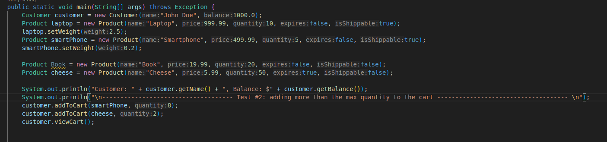

#  Shopping Cart System

This is a simple Java console-based shopping cart system that simulates adding products to a cart, managing stock, checking out, and handling shipping details.

## ✅ Tests

The `tests/` folder contains screenshots of code snippets (queries) and their corresponding output (results).

| Test # | Description | Query | Results |
|--------|-------------|--------|---------|
| **Test 1** | Add valid products to cart within stock limits |  |  |
| **Test 2** | Add more than the available quantity of a product |  |  |
| **Test 3** | Attempt checkout with insufficient balance |  |  |
| **Test 4** | Attempt to remove more quantity than exists in the cart |  |  |
